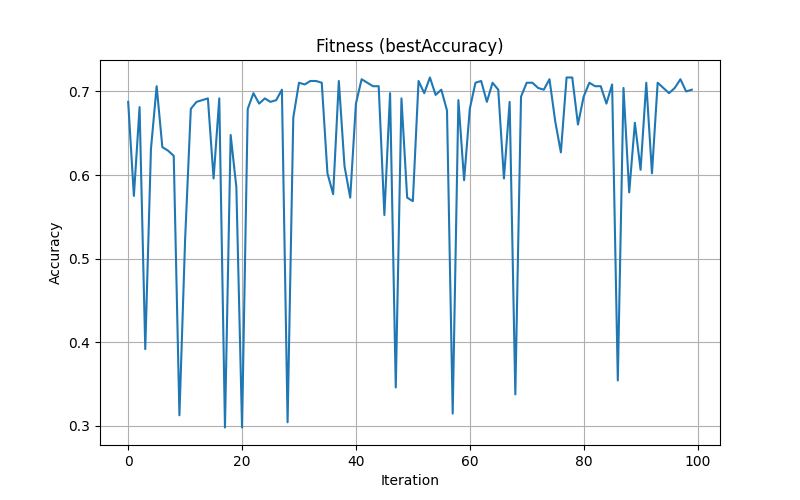
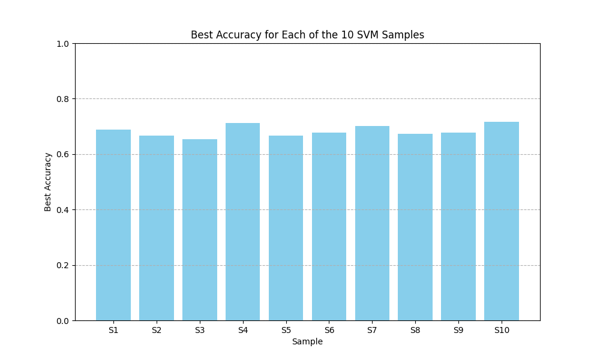

# SVM Optimization on UCI Wine Quality Dataset

This project performs hyperparameter optimization of a Support Vector Machine (SVM) classifier on the **UCI Wine Quality (Red)** dataset. The goal is to evaluate the performance of an SVM classifier using multiple train-test samples and track the convergence of accuracy over 100 randomized optimization iterations.

Author: **Nitin Goyal**
Roll Number: **102203614**

---

## 📊 Dataset

We use the [Wine Quality - Red](https://archive.ics.uci.edu/ml/machine-learning-databases/wine-quality/winequality-red.csv) dataset from the UCI Machine Learning Repository, which contains:

* **1,599 samples** of physicochemical data about red wine
* **11 features** (e.g., acidity, sugar, pH)
* **Target**: Wine quality score (integer)
* **Original classes**: 6 (quality scores: 3, 4, 5, 6, 7, 8)
* **Mapped into 3 classes** for classification:

  * **0**: Low (quality ≤ 5)
  * **1**: Medium (quality = 6)
  * **2**: High (quality ≥ 7)

---

## 🛠️ Methodology

* The dataset is randomly split **10 times** into 70% training and 30% testing sets.
* For each split:

  * The features are standardized.
  * **100 iterations** of randomized SVM optimization are performed using Optuna.
  * The best accuracy and corresponding hyperparameters are recorded.
* **SVM Classifier Used**: `sklearn.svm.NuSVC`
* Hyperparameters optimized:

  * `kernel`: `'rbf'`, `'poly'`, `'sigmoid'`
  * `nu`: float ∈ \[0.1, 0.9]
  * `epsilon`: float ∈ \[0.01, 1.0] *(only logged, not used in `NuSVC`)*

---

## 📈 Outputs

* `svm_optimization_results.csv`: Contains best accuracy and parameters for each of the 10 random samples.
* `convergence_best_svm.png`: Convergence graph showing accuracy vs. iteration for the best-performing sample.
* Console output of all 10 sample results.

---

